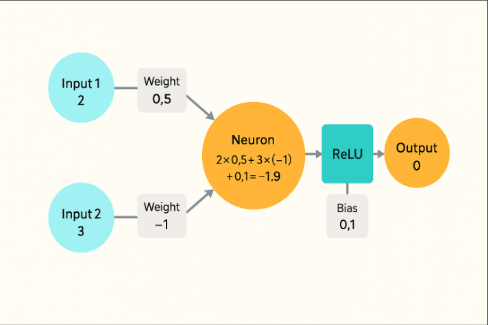

# 🧠 Neuron: The Tiny Worker

A **neuron** is the basic building block of a neural network, like a little worker doing a small job. It processes inputs, applies weights and biases, and produces an output. Let’s break it down step by step.

---

## 🔑 Key Components of a Neuron

1. **Inputs**:
   - These are the pieces of information the neuron receives.
   - Example: If analyzing a picture, each input could represent the brightness of a pixel.

2. **Weights**:
   - Each input is multiplied by a weight, which determines its importance.
   - A large weight means "pay more attention to this input," while a small or negative weight means "this input is less important."

3. **Bias**:
   - A small extra number added to the result, like a starting point, to help the neuron adjust its output.

4. **Activation Function**:
   - After processing the inputs, weights, and bias, the neuron applies an activation function.
   - The activation function decides the final output, such as whether to "activate" (output a value) or not.

---

## ⚙️ How a Neuron Calculates

1. Multiply each input by its corresponding weight.
2. Add up all the weighted inputs.
3. Add the bias to the sum.
4. Pass the result through the activation function to get the final output.

---

## 🧮 Easy Example

Let’s calculate the output of a neuron step by step:

- **Inputs**: `2` and `3` (e.g., pixel brightness values).
- **Weights**: `0.5` and `-1` (importance of each input).
- **Bias**: `0.1` (a small tweak).

### Steps:
1. Multiply inputs by weights:
Step 1: 

2 × 0.5 = 1 3 × -1 = -3
Step 2: 
1 + (-3) = -2
Step 3: 

−2+0.1=−1.9.
Step 4: Use an activation function, like ReLU (which turns negatives to 0): 
ReLU

ReLU(−1.9)=0.
### Final Output:
The neuron’s output is `0`.

---

## 🥣 Analogy: A Chef Making Soup

Think of a neuron as a chef preparing soup:
- **Inputs**: Ingredients (e.g., carrots, salt).
- **Weights**: How much of each ingredient to add (e.g., 2 cups of carrots, a pinch of salt).
- **Bias**: A dash of spice to tweak the flavor.
- **Activation Function**: The chef tastes the soup and decides if it’s good enough to serve.

---

This simple explanation of a neuron lays the foundation for understanding how neural networks process data. Each neuron works like a tiny worker, and together, they form powerful networks capable of solving complex problems.

