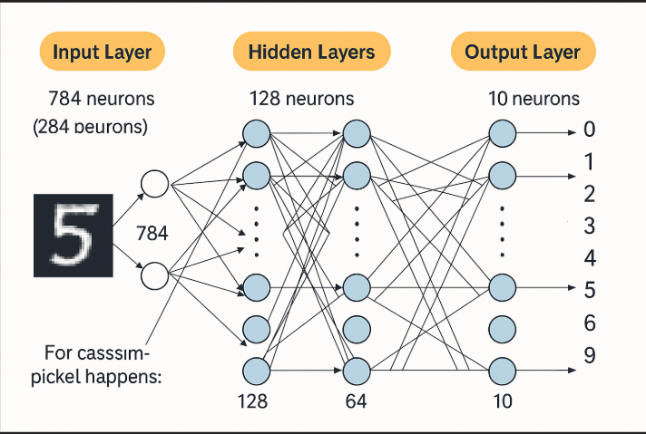

# 🏗️ Layers: The Teamwork Structure

Neurons don’t work alone—they’re organized into **layers**, like floors in a building. Each layer has a specific role in processing data, and together, they form the structure of a neural network.

---

## 🔑 Types of Layers in a Neural Network

### 1️⃣ **Input Layer**
- **Role**:
  - The starting point where raw data enters the network.
  - Each neuron in this layer handles one piece of data.
- **Example**:
  - For a 28x28 pixel image (like a handwritten digit), there are **784 neurons**—one for each pixel.
- **Analogy**:
  - Think of this as the “eyes” that see the raw information.

---

### 2️⃣ **Hidden Layers**
- **Role**:
  - These are the middle layers where the "magic" happens.
  - They take information from the input layer, process it using weights and biases, and pass it along to the next layer.
- **Key Points**:
  - **More hidden layers = more complex patterns learned**.
  - Early layers might detect simple features (e.g., edges in an image), while later layers recognize more complex patterns (e.g., shapes like circles).
- **Example**:
  - A network might have two hidden layers:
    - The first with **128 neurons**.
    - The second with **64 neurons**.
- **Analogy**:
  - These are like workers on an assembly line, each adding their own touch to refine the data.

---

### 3️⃣ **Output Layer**
- **Role**:
  - The final layer that produces the network’s output.
  - For classification tasks, each neuron represents a possible class, and its output is a "confidence score" for that class.
- **Example**:
  - For recognizing digits (0-9), the output layer might have **10 neurons**—one for each digit.
- **Analogy**:
  - This is the “mouth” that announces the final decision.

---

## 🖼️ Picture This: Digit Recognition Example

Let’s break down the layers for a digit recognition task:

1. **Input Layer**:
   - **784 neurons** (one for each pixel in a 28x28 image).
2. **Hidden Layers**:
   - **128 neurons** in the first hidden layer.
   - **64 neurons** in the second hidden layer.
3. **Output Layer**:
   - **10 neurons** (one for each digit from 0 to 9).

---

## 🏭 Analogy: A Factory

Imagine a neural network as a factory:
- **Input Layer**: Raw materials enter the factory (e.g., raw data like pixel values).
- **Hidden Layers**: Workers on an assembly line process and refine the materials step by step.
- **Output Layer**: The finished product is delivered (e.g., the predicted digit).

---

This teamwork structure of layers allows neural networks to process raw data, learn patterns, and produce meaningful outputs. Each layer plays a crucial role in transforming data into insights!

